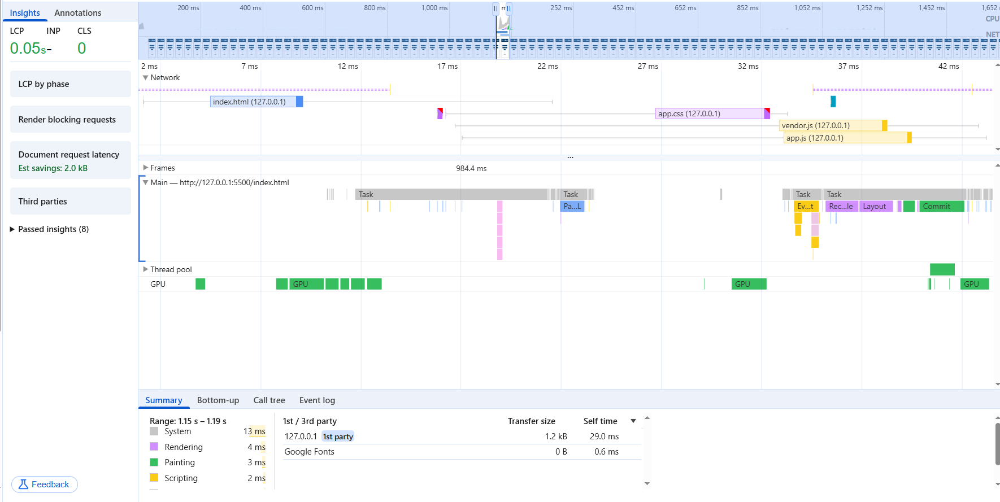

# The Unconventional Calculator
A simple calculator I built with HTML, CSS, and JavaScript. It’s got a cool twist: no equals button (=)! Just hit an operator (like +, -, *, /), and it shows the result right away.
It works perfectly on the tiniest screens and the biggest ones—fully responsive!

## Features
- **Instant Results:** Press an operator, and the answer pops up—no extra button needed.
- **Extra Operators:** Works with addition, subtraction, multiplication, division, power (^), and percent (%).
- **Dark/Light Mode:** Switch between themes with one click.
- **Clear All:** Reset everything (result, input, logs) with a single button.
- **Calculation Log:** Check the history of your calculations in the console.

## How It Works
1. Type a number.
2. Click an operator (like * or +).
3. See the result instantly!

## Why It’s Special
This isn’t just a quick project—it’s a small idea with big effort. As a frontend developer with a solid grasp of backend optimization, I crafted clean, readable code that shines through its structure.
The project is split across multiple files:
- **`index.html`:** The main structure of the page.
- **`assets/styles/app.css`:** Styles to make it look great.
- **`assets/scripts/vendor.js`:** Connects the HTML elements to the logic and manages output.
- **`assets/scripts/app.js`:** Handles all the calculations and logic.

### Load Order Magic
I optimized the loading process like a backend pro: `index.html` loads first to build the page (parsed by 7ms), followed by `app.css` for styling, then `vendor.js`.
And finally `app.js`—all thanks to the `defer` attribute ensuring scripts wait for HTML to be ready.
This smooth flow is visible in the Chrome DevTools Performance tab. Check the detailed breakdown in the screenshot below:

### Safety First
All falsy values (like empty inputs or zeros) are filtered out, keeping the calculator secure.
As someone who understands both frontend and backend, I ensured users can’t break it by tampering with the input—security is rock-solid.

### Console Logging
You can see everything you’ve done in the console history—and even clear it with a button! Check out the console log screenshot below:

### Fun Fact
The JS code, combining both `vendor.js` and `app.js`, without comments, line breaks, or extra spaces, is just 34 lines! See it here: [minified.js](minified/minified.js).

## Screenshots
Here’s what the calculator looks like in both themes:
- **Light Theme:** 
- **Dark Theme:** 

## Additional Screenshots
All screenshots, including the `Performance.png` (load and parse order) and `Console_Log.png` (console history), are stored in the `image` folder.

## Links
- **GitHub Repository:** []
- **Live Demo:** []

## About
- **Gmail:** [ali.amini.codes@gmail.com]
- **LinkedIn:** [https://www.linkedin.com/in/ali-amini-codess]